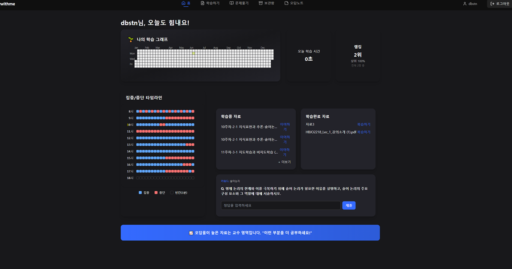
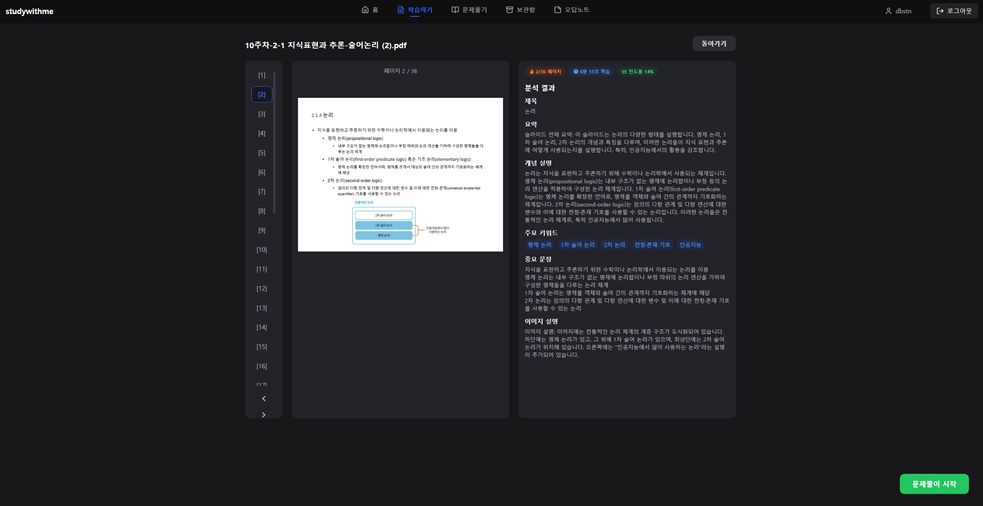
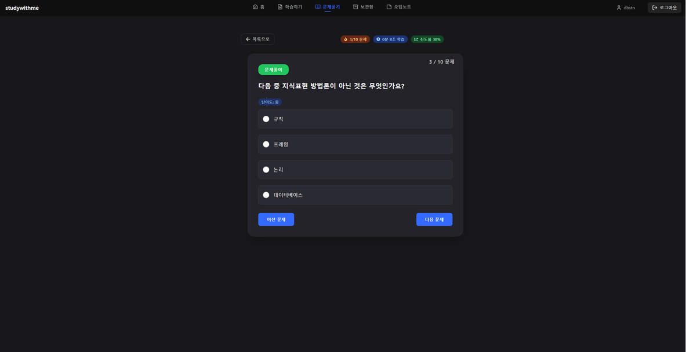
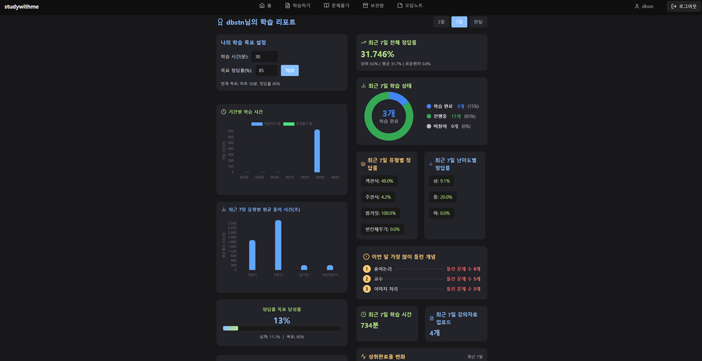

# 대학생 학습 도우미 플랫폼

> **Node.js(Express) + FastAPI + React 기반**  
> 강의자료 PDF 업로드, OCR, 자동 요약/문제 생성, 사용자 인증/문제풀이 등 통합 학습 플랫폼

---

## 프로젝트 구조

```
project-root/
├── backend/           # 백엔드 (Node.js, FastAPI, DB)
│   ├── config/        # 설정/초기화 스크립트 (ex. create_database.sql)
│   ├── uploads/       # 업로드 파일 (PDF 등)
│   ├── temp_files/    # 임시 파일
│   ├── venv/          # Python 가상환경 (git에 올리지 않음)
│   ├── .env           # 환경변수 (git에 올리지 않음)
│   ├── .env.example   # 환경변수 예시
│   ├── requirements.txt
│   ├── package.json
│   ├── main.py, server.js, ... # 주요 백엔드 코드
│   └── ...
├── frontend/          # 프론트엔드 (React 등)
│   ├── public/
│   ├── src/
│   ├── .env
│   ├── .env.example
│   ├── package.json
│   └── ...
├── .gitignore
├── README.md
└── ...
```

---

## 빠른 시작

### 1. 저장소 클론
```bash
git clone [repository-url]
cd backend
```

### 2. 의존성 설치
- **Node.js**
  ```bash
  npm install
  ```
- **Python**
  ```bash
  python -m venv venv
  source venv/bin/activate  # (Windows: venv\Scripts\activate)
  pip install -r requirements.txt
  ```

### 3. 환경 변수 설정
- `.env.example` 파일을 복사해 `.env`로 만들고, 값을 채워주세요.
- **백엔드 예시**
  ```env
  PORT=3000
  DB_HOST=localhost
  DB_USER=root
  DB_PASSWORD=1234
  DB_NAME=study_platform
  JWT_SECRET=your-secret-key
  OPENAI_API_KEY=your-openai-api-key
  ```

### 4. 데이터베이스 초기화
- MariaDB/MySQL에서 아래 명령어로 DB/테이블 생성
  ```bash
  mysql -u root -p < config/create_database.sql
  ```

### 5. 서버 실행
- **Node.js**
  ```bash
  npm start
  ```
- **FastAPI**
  ```bash
  uvicorn main:app --reload
  ```

---

## 주요 기능
- PDF 강의자료 업로드 및 관리
- OCR(텍스트 추출, Tesseract)
- 슬라이드 요약 및 문제 자동 생성
- 사용자 인증/문제풀이/오답노트/약점 분석
- 학습 진도 및 intensity 추적

---

## 실행 화면

| 메인 화면 | 강의자료 요약 |
| :-: | :-: |
|  |  |

| 문제 풀이 | 학습 리포트 |
| :-: | :-: |
|  |  |


---

## 기술 스택
- Node.js, Express.js
- FastAPI, Python
- MariaDB
- JWT 인증
- 외부 요약/문제 생성 API
- Tesseract OCR
- React (프론트)

---

## 환경 변수 예시 (`.env.example`)
```env
PORT=3000
DB_HOST=localhost
DB_USER=root
DB_PASSWORD=1234
DB_NAME=study_platform
JWT_SECRET=your-secret-key
OPENAI_API_KEY=your-openai-api-key
```

---

## 데이터베이스 초기화
- **DB 스키마/초기화:**
  ```bash
  mysql -u root -p < backend/config/create_database.sql
  ```
- **주의:** 기존 study_platform DB가 생성됩니다. 필요시 삭제 쿼리문을 실행하세요. 

---

## Tesseract OCR 설치 안내

### 1. 설치 방법
- **Windows:** [UB Mannheim Tesseract 설치 파일](https://github.com/UB-Mannheim/tesseract/wiki) 다운로드/설치 후 환경변수 등록
- **Mac:**
  ```bash
  brew install tesseract
  ```
- **Linux:**
  ```bash
  sudo apt-get install tesseract-ocr
  ```

### 2. 언어 데이터 추가
- 한글: `kor.traineddata`
- 영어: `eng.traineddata`
- 다운로드 후 Tesseract의 `tessdata` 폴더에 넣으세요.

### 3. 파이썬 코드에서 경로 지정 예시
```python
import pytesseract
pytesseract.pytesseract.tesseract_cmd = r'C:\Program Files\Tesseract-OCR\tesseract.exe'  # Windows 예시
```

### 4. 참고 링크
- [Tesseract 공식 문서](https://tesseract-ocr.github.io/)
- [파이썬 pytesseract 문서](https://pypi.org/project/pytesseract/)

---

## 주요 API 엔드포인트 (예시)

### 인증/사용자
- `POST /register` - 회원가입
- `POST /login` - 로그인
- `GET /api/profile` - 사용자 정보 조회

### 강의자료/슬라이드
- `POST /api/upload` - PDF 업로드
- `GET /archive/list` - 업로드된 자료 목록
- `GET /archive/:lecture_id` - 특정 자료의 슬라이드 요약
- `POST /archive/:lecture_id/slide/:slide_number/summary` - 슬라이드 요약 생성
- `POST /archive/:lecture_id/summary` - 전체 자료 요약

### 문제/학습 관리
- `POST /quiz/generate` - 슬라이드 기반 문제 자동 생성
- `POST /quiz/submit` - 문제 제출/채점
- `GET /quiz/wrong-notes` - 오답노트 전체 조회
- `POST /api/study-time` - 학습 시간 기록
- `GET /api/study-intensity/today` - 오늘의 학습 강도
- `GET /api/study-intensity/month` - 이번 달 학습 강도

---

## 주의사항
- `.env`, `venv/`, `node_modules/`, `uploads/` 등은 git에 올리지 마세요. `.gitignore`로 관리
- `create_database.sql` 실행 시 기존 DB가 삭제/재생성됩니다. 운영 환경에서는 주의!
- Tesseract 설치/경로/언어데이터는 각자 환경에 맞게 설정
- 민감정보는 `.env`로만 관리, 절대 커밋 금지

---

## 문의/기여
- 이슈/PR/질문은 언제든 환영합니다! 